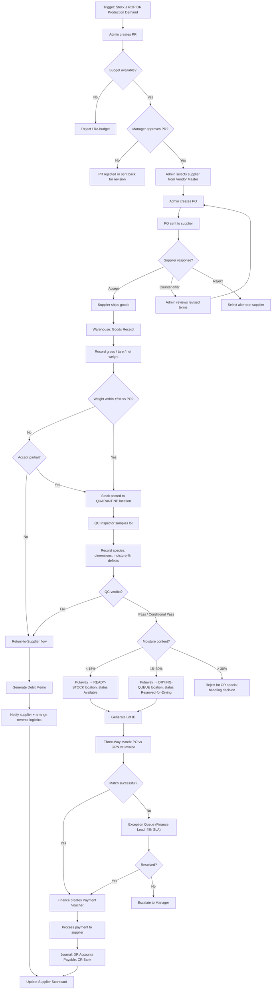
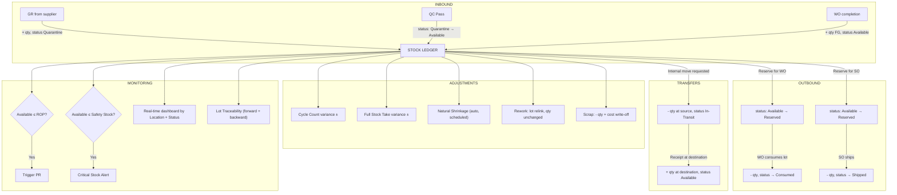

## Glossary (Abbreviations & Terms)

| Term | Full Meaning |
|------|--------------|
| **P2P** | Procure-to-Pay — the full cycle from identifying a need to paying the supplier |
| **PR** | Purchase Requisition — an internal request to buy something |
| **PO** | Purchase Order — the formal order sent to the supplier |
| **GR** | Goods Receipt — the act of physically accepting goods |
| **GRN** | Goods Receipt Note — the document confirming the receipt |
| **QC** | Quality Control / Quality Inspection |
| **RM** | Raw Material |
| **WIP** | Work-in-Progress — items partially through production |
| **FG** | Finished Goods |
| **WO** | Work Order — a production order |
| **SO** | Sales Order — a customer order |
| **BOM** | Bill of Materials — what raw materials make one finished item |
| **ATP** | Available-to-Promise — stock you can commit to new customer orders |
| **ROP** | Reorder Point — the stock level that triggers replenishment |
| **FIFO** | First-In-First-Out — oldest stock used first |
| **FEFO** | First-Expired-First-Out — earliest-expiring stock used first |
| **Lot** | A batch of material with shared characteristics (one receipt, one production run) |
| **Putaway** | Moving received goods to their storage location |
| **Quarantine** | A holding location for stock pending QC decision |
| **Three-Way Match** | Validating PO, GRN, and Invoice agree before payment |
| **Debit Memo** | Document that reduces the amount payable to a supplier (e.g., for returns) |
| **Lead Time** | Time from PO placement to GR |
| **Vendor Master** | Master list of approved suppliers with their terms and ratings |
| **Cycle Count** | Frequent partial counts (vs. full stock take) |
| **A/B/C Class** | ABC analysis — A items are top 20% by value, B next 30%, C remaining 50% |

---

## BP-01: Procure-to-Pay (P2P) — Raw Material Procurement

### Overview

| Aspect | Detail |
|--------|--------|
| Trigger | Stock at or below Reorder Point, OR direct production demand |
| End State | Supplier paid; raw material lot available in inventory |
| Actors | Procurement Admin, Procurement Manager, Supplier, Warehouse Staff, QC Inspector, Finance Team |
| Typical Duration | 3–7 business days (excluding supplier lead time) |
| Key Documents | PR, PO, GRN, QC Report, Supplier Invoice, Payment Voucher, Debit Memo (if applicable) |

### Process Flow



### Business Rules (Parameterized)

| Rule ID | Description | Parameter | Default |
|---------|-------------|-----------|---------|
| BR-01.1 | Threshold above which PR is required | PR threshold | IDR 5,000,000 |
| BR-01.2 | Manager approval required if PR exceeds limit | Approval limit | IDR 50,000,000 |
| BR-01.3 | Auto-accept weight tolerance vs PO | Weight tolerance | ±5% |
| BR-01.4 | Moisture: Ready-Stock | Threshold | < 15% |
| BR-01.5 | Moisture: Drying Queue | Range | 15–30% |
| BR-01.6 | Moisture: Reject / Special | Threshold | > 30% |
| BR-01.7 | Three-Way Match price tolerance | Price tolerance | ±1% |
| BR-01.8 | Three-Way Match quantity tolerance | Qty tolerance | ±2% |
| BR-01.9 | Exception Queue SLA | Response time | 48 business hours |
| BR-01.10 | Supplier Scorecard recalculation | Trigger | After every payment OR return |

*All defaults are configurable per material type and per supplier.*

### State Machines

**PR States:** `Draft → Submitted → Pending Budget → Pending Approval → Approved | Rejected → Closed`

**PO States:** `Draft → Sent → Confirmed | Counter-offered → Partially Received → Fully Received → Closed | Cancelled`

### Change Log — What I Added vs. Original

| # | Original | Adjustment | Reason |
|---|----------|------------|--------|
| 1 | No budget check before PR approval | Budget validation gate added | Prevents invisible overspending |
| 2 | Supplier picked freely | Must come from Vendor Master | Enables qualification + audit + scorecards |
| 3 | GR → Lot ID → Putaway (direct) | Quarantine + QC step added before lot finalization | Weight match ≠ quality match |
| 4 | Moisture captured but unused | Moisture drives routing (Ready / Drying / Reject) | Makes BR a real control, not just documentation |
| 5 | "Flag exception manual" black hole | Defined Exception Queue with owner + 48h SLA + escalation | Prevents finance backlog |
| 6 | No return-to-supplier flow | Added with Debit Memo + reverse logistics + scorecard hit | Rejected shipments are routine in wood |
| 7 | No feedback loop | Scorecard updated after every payment AND return | Future supplier selection becomes data-driven |
| 8 | State transitions implicit | PR/PO state machines defined | Required for reporting and dashboards |

---

## BP-06: Inventory Management — Stock Cycle

### Overview

| Aspect | Detail |
|--------|--------|
| Scope | All inventory movements across all locations (RM, Drying, WIP, FG, Quarantine, Scrap) |
| Actors | Warehouse Staff, Warehouse Supervisor, QC Inspector, Production Team, Sales Team, Finance |
| Core Concept | Stock is identified by Item × Lot × Location × Status — not just total quantity |

### Stock Data Model (Critical Foundation)

```
Stock Record = (Item × Lot × Location × Status × Quantity)
```

**Locations** (examples — adjust to client's actual layout):

| Location Code | Purpose |
|---------------|---------|
| WH-RM-01 | Raw Material Warehouse (ready) |
| WH-DRY-01 | Drying Area |
| WH-QC-01 | Quarantine (pending QC verdict) |
| WH-WIP-01 | Work-in-Progress Staging |
| WH-FG-01 | Finished Goods Warehouse |
| WH-SCRAP | Scrap Disposal Area |

**Status values:** `Available | Reserved | Quarantine | Reserved-for-Drying | In-Transit | Scrap-Pending`

### Process Flow



### Stock Movement Types

| Type | Symbol | Trigger | Effect | Example |
|------|:------:|---------|--------|---------|
| IN | 🟢 | GR posted | +qty at (RM, Quarantine) | Supplier delivery accepted |
| QC-RELEASE | 🟢 | QC Pass | Status: Quarantine → Available | Lot passes inspection |
| RESERVE | 🟡 | WO/SO created | Status: Available → Reserved | Lot allocated to WO-1234 |
| CONSUME | 🔴 | WO pulls material | -qty (Reserved → Consumed) | Lot used in production |
| PRODUCE | 🟢 | WO finishes | +qty at (FG, Available) | New pallet batch completed |
| SHIP | 🔴 | SO delivered | -qty (Reserved → Shipped) | Customer delivery |
| TRANSFER-OUT | 🔵 | Internal move start | -qty at source, In-Transit | Drying area → Ready-Stock |
| TRANSFER-IN | 🔵 | Internal move end | +qty at destination, Available | Arrived at new location |
| ADJ-COUNT+ | 🟡 | Count surplus | +qty | Physical > System |
| ADJ-COUNT− | 🟡 | Count shortage | -qty | Physical < System |
| ADJ-SHRINK | 🟡 | Scheduled (auto) | -qty | Natural moisture loss |
| REWORK | 🟣 | Rework order | Lot relink, qty unchanged | Damaged pallet re-built |
| SCRAP | ⚫ | Scrap order | -qty + cost write-off journal | Lot deemed unusable |

### Inventory Threshold Levels

| Term | Definition | Action when reached |
|------|------------|---------------------|
| Maximum Stock | Upper limit (storage cap or capital limit) | Stop reordering |
| Reorder Point (ROP) | `Avg Daily Usage × Lead Time + Safety Stock` | Auto-trigger PR |
| Safety Stock | Buffer for demand/supply variability | Alert if breached |
| Minimum Stock | Critical level — production at risk | Escalate to Manager |

> Your current spec collapses these into a single "stok minimum." They are four different things and each triggers a different action. Please align internally.

### Lot Traceability Design

**Forward (from RM lot):**
`Lot RM-A123 → consumed in WO-456 (60%) + WO-457 (40%) → produced FG batches PJ-X1, PJ-X2 → shipped on SO-789, SO-790 → delivered to Customer C1, C2`

**Backward (from FG batch):**
`Pallet batch PJ-X1 → produced from WO-456 → consumed lots RM-A123 (60%) + RM-A124 (35%) + RM-A125 (5%) → sourced from Suppliers S1, S2`

**Implementation requirement:** many-to-many relationship between RM lots and FG batches, with proportion tracking. Without this, you cannot do real recall.

### Allocation Policy (Outbound)

- **Default:** FEFO — based on each lot's drying-readiness or condition window
- **Fallback:** FIFO — for non-perishable / stable items
- **Override:** Manual selection by Warehouse Supervisor, written to audit log

### Natural Shrinkage Parameters

| Material Class | Moisture Bracket | Auto-Shrinkage Rate |
|----------------|------------------|---------------------|
| Wet wood lot | 15–30% moisture | 1.5% / month |
| Dry wood lot | < 15% moisture | 0.3% / month |
| Finished pallets | N/A | 0.1% / month (handling loss) |

*Rates configurable. Auto-calculated nightly. Variance vs. opname → investigation.*

### Stock Take / Opname Cycle

| Type | Frequency | Scope | Variance Approver |
|------|-----------|-------|-------------------|
| Cycle Count | Daily | A-class items (top 20% value) | Warehouse Supervisor |
| Cycle Count | Weekly | B-class items (next 30%) | Warehouse Supervisor |
| Cycle Count | Monthly | C-class items (remaining 50%) | Warehouse Supervisor |
| Full Stock Take | Quarterly | All items, all locations | Manager + Finance |

**Variance auto-approve threshold:** ±0.5% by quantity AND ≤ IDR 500,000 by value. Beyond this → investigation required.

### Change Log — What I Added vs. Original

| # | Original | Adjustment | Reason |
|---|----------|------------|--------|
| 1 | Single "STOK" entity | `Stock = Item × Lot × Location × Status` | Enables multi-warehouse, quarantine, ATP |
| 2 | Allocation = stock reduction | Reserved vs. Available distinction | Stops sales over-committing |
| 3 | No WIP visibility | WIP is a first-class location | Cost and physical stock stop diverging |
| 4 | Lot traceability listed but undefined | Many-to-many design (forward + backward, with proportions) | Enables real recall |
| 5 | "Rework atau Scrap" merged | Separated as different movement types | Rework ≠ write-off; different journals + approvals |
| 6 | Single "minimum stock" threshold | Max / ROP / Safety / Min — four distinct levels | Each triggers different action |
| 7 | Opname undefined | ABC-based cycle + variance tolerance + approver matrix | Prevents annual shock variances |
| 8 | No allocation policy | FEFO default, FIFO fallback, manual override with log | Wood degrades; older lots must move first |
| 9 | "Susut alami" mentioned only | Parameterized auto-shrinkage with audit trail | Prevents fraud + reconciles to opname |

---

## Things I'd flag for your review

1. **The single most architectural item:** is your team's data model ready for `Stock = (Item × Lot × Location × Status)`? If they answer "we just track qty per SKU" — that's the engineering work for Phase 1 and you should not show the demo until that's true. Everything in BP-06 collapses without it.

2. **Default parameters** (5% weight, 15%/30% moisture, ±1% price tolerance, IDR thresholds, shrinkage rates) — these are my guesses. The owner should validate them on Wednesday based on actual wood-pallet industry norms in his operation.

3. **Quarantine location:** your team may resist adding this step ("it slows down GR"). Hold the line — it's the difference between a real WMS and a glorified spreadsheet.

4. **PR/PO state machines:** if your team isn't already implementing these as explicit state fields with transition rules, that's hidden technical debt.

Take your time reviewing. When you're ready, want me to:
- Render the PR/PO state machines as proper diagrams, or
- Move on to BP-06 screens (stock dashboard would be my pick), or
- Take a second pass at one of these BPs based on your edits?