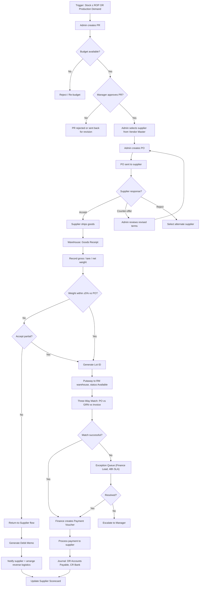

Simplified BP-01 below — QC and moisture-based routing are removed for this iteration (deferred to Phase 2). Flow is now strictly procurement + finance.

---

## Glossary (for this BP)

| Term | Full Meaning |
|------|--------------|
| **P2P** | Procure-to-Pay — full cycle from need identification to supplier payment |
| **PR** | Purchase Requisition — internal request to buy something |
| **PO** | Purchase Order — formal order sent to the supplier |
| **GR** | Goods Receipt — act of physically accepting goods |
| **GRN** | Goods Receipt Note — document confirming receipt |
| **RM** | Raw Material |
| **ROP** | Reorder Point — stock level that triggers replenishment |
| **Lot** | A batch of material from one receipt, sharing the same characteristics |
| **Putaway** | Moving received goods to their storage location |
| **Three-Way Match** | Validating PO, GRN, and Invoice agree before payment |
| **Debit Memo** | Document reducing the amount payable to a supplier (e.g., for returns) |
| **Vendor Master** | Master list of approved suppliers with their terms and ratings |

---

## BP-01: Procure-to-Pay (P2P) — Raw Material Procurement (Simplified)

### Overview

| Aspect | Detail |
|--------|--------|
| Trigger | Stock at or below ROP, OR direct production demand |
| End State | Supplier paid; raw material lot available in inventory |
| Actors | Procurement Admin, Procurement Manager, Supplier, Warehouse Staff, Finance Team |
| Typical Duration | 3–7 business days (excluding supplier lead time) |
| Key Documents | PR, PO, GRN, Supplier Invoice, Payment Voucher, Debit Memo (if returns) |
| Scope (this iteration) | Procurement + Finance only. Quality inspection deferred to Phase 2. |
| Out of Scope | QC inspection, moisture-based routing, quarantine location |

### Process Flow

### Business Rules (Parameterized)

| Rule ID | Description | Parameter | Default |
|---------|-------------|-----------|---------|
| BR-01.1 | Threshold above which PR is required | PR threshold | IDR 5,000,000 |
| BR-01.2 | Manager approval required if PR exceeds limit | Approval limit | IDR 50,000,000 |
| BR-01.3 | Auto-accept weight tolerance vs PO | Weight tolerance | ±5% |
| BR-01.4 | Three-Way Match price tolerance | Price tolerance | ±1% |
| BR-01.5 | Three-Way Match quantity tolerance | Qty tolerance | ±2% |
| BR-01.6 | Exception Queue SLA | Response time | 48 business hours |
| BR-01.7 | Supplier Scorecard recalculation | Trigger | After every payment OR return |

*All defaults are configurable per material type and per supplier.*

### State Machines

**PR States:**
`Draft → Submitted → Pending Budget → Pending Approval → Approved | Rejected → Closed`

**PO States:**
`Draft → Sent → Confirmed | Counter-offered → Partially Received → Fully Received → Closed | Cancelled`

### Supplier Scorecard Metrics (tracked per PO cycle)

| Metric | Calculation |
|--------|-------------|
| Delivery Accuracy | (Delivered qty / Ordered qty) × 100% |
| On-Time Delivery | Days actual vs days promised |
| Weight Accuracy | Average absolute deviation vs PO |
| Return Rate | (Returned shipments / Total shipments) × 100% |

### Change Log — What Changed vs. Previous Version

| # | Previous Version | This Iteration | Why |
|---|------------------|----------------|-----|
| 1 | Quarantine location after GR | Removed — Putaway goes directly to RM warehouse | QC deferred |
| 2 | QC Inspector samples lot | Removed entire QC node | QC deferred to Phase 2 |
| 3 | Moisture-based routing (<15%, 15–30%, >30%) | Removed all three branches | Moisture is a QC concern; deferred |
| 4 | Moisture-related Business Rules (BR-01.4 to BR-01.6) | Removed | Same reason |
| 5 | Two location types post-receipt (Ready-Stock / Drying-Queue) | Collapsed to single RM warehouse with status Available | Simplified |

### What's Deferred to Phase 2

Track these so they don't get lost when QC is added later:

| Deferred Item | Where It Will Plug Back In |
|---------------|----------------------------|
| Quarantine location | Between GR and Putaway |
| QC Inspection step | Right after weight check, before Lot ID generation |
| Moisture-based routing | Replaces the single "Putaway" node with three branches |
| Lot rejection on QC fail | Joins the existing Return-to-Supplier flow |

---

## Things to flag for review

1. **Lot ID generation is now at GR.** Since there's no QC gate, the lot is considered "good" as soon as it passes the weight check. Make sure your team is comfortable with this assumption — it means bad-quality material can enter Available stock and only get caught at production time. Acceptable for Phase 1 *if* the warehouse staff visually inspect for obvious damage during GR.

2. **The Supplier Scorecard is intentionally kept** even in this simplified version. It's cheap to implement now (just delivery + weight metrics) and removing it later is harder than keeping it.

3. **Return-to-Supplier flow is kept** — even without QC, weight-mismatch rejections will trigger this. Worth keeping in scope.

4. **No Quarantine location** in this version means your stock data model can have one fewer location code for Phase 1. Small simplification but worth confirming with engineering.

Want me to redraw the PR / PO state machines as proper diagrams next, or move on to designing the GR / Invoice screens for the demo?