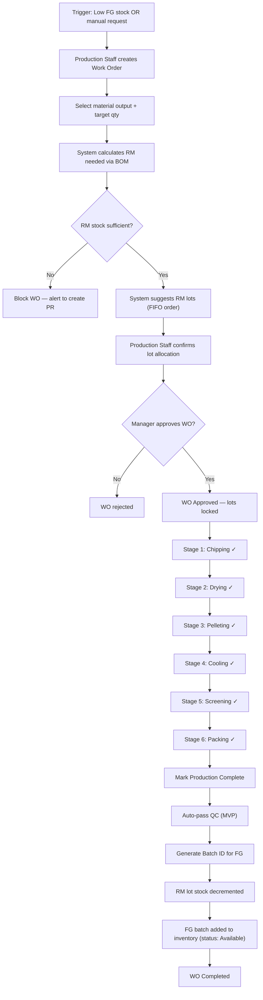

# BP-02: Production (Simplified) — Produce-to-Stock

> QC auto-passed for MVP. Rework, scrap, and HPP tracking deferred to Phase 2.

---

## Glossary

| Term | Meaning |
|------|---------|
| **WO** | Work Order — the job ticket to run a production batch |
| **BOM** | Bill of Materials — how much raw material is needed per unit of output |
| **Lot (RM)** | Raw material lot from GR, tracked by Lot ID |
| **Batch (FG)** | Finished goods output from one WO, gets its own Batch ID |
| **FIFO** | First In First Out — oldest RM lots consumed first |
| **Lot Lock** | RM lots allocated to a WO cannot be used by another WO |
| **FG** | Finished Goods — wood pellets ready for sale |

---

## BP-02: Produce-to-Stock (MVP Simplified)

### Overview

| Aspect | Detail |
|--------|--------|
| Trigger | Low finished goods stock OR manual creation by Production Staff |
| End State | FG batch available in inventory, ready for Sales Order |
| Actors | Production Staff, Manager, Warehouse Staff |
| Typical Duration | 1–2 days per batch |
| Scope (MVP) | Work Order → material consumption → production stages → FG stock IN |
| Out of Scope | QC inspection, rework, scrap, HPP cost tracking, CoA generation |

### Process Flow

### Production Stages (MVP)

Each stage is a simple checkbox/status toggle — no detailed input required for MVP.

| Stage | Name | What staff marks |
|:-----:|------|-----------------|
| 1 | Chipping | Done / timestamp |
| 2 | Drying | Done / timestamp |
| 3 | Pelleting | Done / timestamp |
| 4 | Cooling | Done / timestamp |
| 5 | Screening | Done / timestamp |
| 6 | Packing | Done / timestamp |

### Business Rules (MVP)

| Rule ID | Description | Value |
|---------|-------------|-------|
| BR-02.1 | WO requires Manager approval before production starts | Enforced |
| BR-02.2 | RM lots allocated to a WO are locked — no other WO can use them | Enforced |
| BR-02.3 | FIFO lot selection — oldest GR date first | Enforced |
| BR-02.4 | RM stock decremented only when WO reaches Completed | On completion |
| BR-02.5 | FG stock added only when WO reaches Completed | On completion |
| BR-02.6 | QC auto-passed for MVP — all completed batches go directly to Available | MVP rule |

### State Machine

**WO States:**
`Draft → Submitted → Approved | Rejected → In Progress → Production Complete → Completed`

### What's Deferred to Phase 2

| Deferred | Plug-in point |
|----------|---------------|
| QC inspection (8 ENplus parameters) | Between Production Complete and Completed |
| Rework flow | Replaces auto-pass when QC fails |
| Scrap flow | Replaces auto-pass when rework not possible |
| CoA generation | After QC Passed |
| HPP cost tracking per stage | Inside each stage step |
| Waste/yield recording per stage | Inside each stage step |
