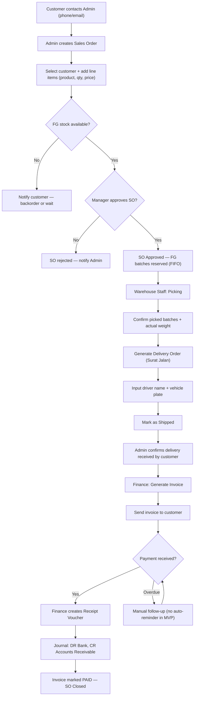

# BP-03: Sales (Simplified) — Order-to-Cash

> Credit limit check, customer portal, and return flow deferred to Phase 2.

---

## Glossary

| Term | Meaning |
|------|---------|
| **O2C** | Order-to-Cash — full cycle from customer order to payment received |
| **SO** | Sales Order — confirmed order from a customer |
| **DO** | Delivery Order (Surat Jalan) — document authorizing shipment |
| **Picking** | Selecting specific FG batches from warehouse to fulfill an SO |
| **FIFO** | Oldest FG batches shipped first |
| **AR** | Accounts Receivable — money owed by customer |
| **Receipt Voucher** | Document confirming payment received from customer |
| **Customer Master** | Master list of customers with their contact and payment terms |

---

## BP-03: Order-to-Cash (MVP Simplified)

### Overview

| Aspect | Detail |
|--------|--------|
| Trigger | Customer places an order (via Admin) |
| End State | Payment received; AR closed |
| Actors | Sales Admin, Manager, Warehouse Staff, Finance Team, Customer |
| Typical Duration | 2–5 days delivery + 0–60 days payment |
| Scope (MVP) | SO creation → stock pick → delivery → invoice → payment |
| Out of Scope | Credit limit check, customer self-service portal, return/refund flow, partial delivery |

### Process Flow

### Business Rules (MVP)

| Rule ID | Description | Value |
|---------|-------------|-------|
| BR-03.1 | SO requires Manager approval before picking begins | Enforced |
| BR-03.2 | Only FG batches with status Available can be picked | Enforced |
| BR-03.3 | FIFO picking — oldest production date first | Enforced |
| BR-03.4 | Stock decremented when SO is marked Shipped | On shipment |
| BR-03.5 | Invoice can only be generated after delivery confirmed | Enforced |
| BR-03.6 | Credit limit check skipped for MVP | Skipped |
| BR-03.7 | Payment terms set per customer in Customer Master (COD / Net 30 / Net 60) | Informational only in MVP |

### State Machine

**SO States:**
`Draft → Submitted → Approved | Rejected → Picking → Shipped → Delivered → Invoiced → Paid`

**Invoice States:**
`Draft → Sent → Paid | Overdue`

### What's Deferred to Phase 2

| Deferred | Plug-in point |
|----------|---------------|
| Credit limit check | Before SO approval |
| Auto payment reminder | After invoice due date passes |
| Customer self-service portal | Parallel to Admin SO creation |
| Return / refund flow | After Delivered state |
| Partial delivery | Split SO into multiple DOs |
| CoA attached to Delivery Order | After QC is implemented in BP-02 |
