# 🔄 WF-IMS — Business Process Documentation

> **Project:** Wood Fuel Integrated Management System  
> **Version:** 1.0

---

## 1. Proses Bisnis Utama (End-to-End)

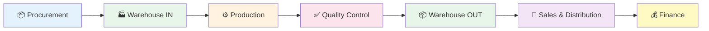

---

## 2. BP-01: Procure-to-Pay (P2P) — Pengadaan Bahan Baku

### Overview
| Aspek | Detail |
|-------|--------|
| **Trigger** | Stok bahan baku di bawah minimum / permintaan produksi |
| **End State** | Pembayaran ke supplier selesai, stok bahan baku bertambah |
| **Aktor** | Admin, Manager, Supplier, Staff Gudang, Tim Keuangan |
| **Durasi Tipikal** | 3-7 hari kerja |

### Alur Proses

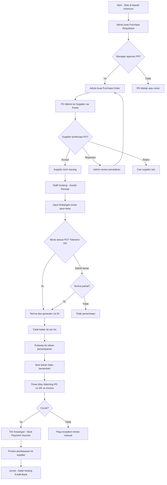

### Business Rules
1. **PR → PO**: Setiap pembelian harus melalui PR yang diapprove Manager
2. **Toleransi Berat**: Selisih timbangan ±5% dari qty PO, lebih dari itu butuh approval
3. **Lot Classification**: Moisture < 15% (siap produksi), 15-30% (perlu drying), > 30% (terlalu basah)
4. **Three-Way Matching**: PO, GR, dan Invoice supplier harus cocok sebelum pembayaran

---

## 3. BP-02: Produce-to-Stock — Proses Produksi

### Overview
| Aspek | Detail |
|-------|--------|
| **Trigger** | Kebutuhan produksi / stok produk jadi rendah |
| **End State** | Batch pellet yang QC passed masuk stok produk jadi |
| **Aktor** | Staff Produksi, Staff QC, Manager |
| **Durasi Tipikal** | 1-3 hari per batch |

### Alur Proses

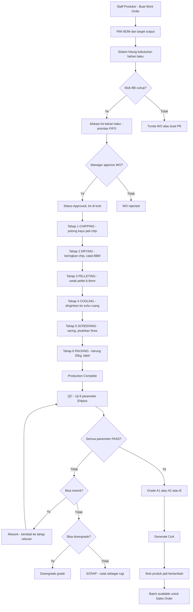

### 6 Tahap Produksi — Detail Input/Output

| Tahap | Proses | Input | Output | Waste | Durasi Est. |
|:-----:|--------|-------|--------|-------|:-----------:|
| 1 | **Chipping** | Kayu gelondongan | Wood chip kecil | Kulit, potongan (~1%) | 4 jam |
| 2 | **Drying** | Chip basah (~18%) | Chip kering (<12%) | Uap air (~15%) | 17 jam |
| 3 | **Pelleting** | Chip kering | Pellet 6-8mm | Debu, fines (~2%) | 8 jam |
| 4 | **Cooling** | Pellet panas | Pellet suhu ruang | Minimal | 2 jam |
| 5 | **Screening** | Pellet mixed | Pellet grade OK | Fines (<3.15mm) | 1.5 jam |
| 6 | **Packing** | Pellet OK | Karung 25kg berlabel | — | 2 jam |

### Business Rules
1. **FIFO Lot**: Lot yang masuk lebih dulu diprioritaskan untuk produksi
2. **Lot Lock**: Lot yang dialokasikan ke WO tidak bisa dipakai WO lain
3. **QC Wajib**: Stok HANYA bertambah setelah QC PASSED
4. **Rework**: Moisture fail → re-dry, fines fail → re-screen, durability fail → re-pellet
5. **HPP Tracking**: Setiap tahap mencatat biaya untuk kalkulasi HPP per batch

---

## 4. BP-03: Order-to-Cash (O2C) — Penjualan & Penagihan

### Overview
| Aspek | Detail |
|-------|--------|
| **Trigger** | Pesanan pelanggan masuk (telepon/portal) |
| **End State** | Pembayaran pelanggan diterima, piutang lunas |
| **Aktor** | Admin/Pelanggan, Manager, Staff Gudang, Tim Keuangan |
| **Durasi Tipikal** | 2-5 hari (kirim) + 30-60 hari (bayar) |

### Alur Proses

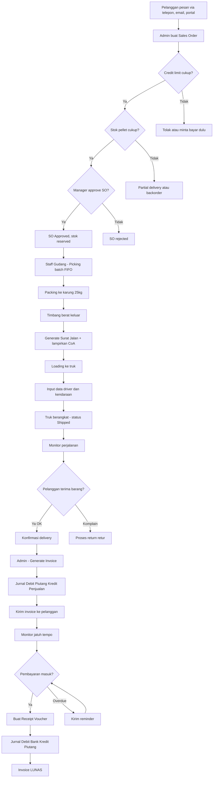

### Business Rules
1. **Credit Check**: SO tidak bisa dibuat jika melebihi credit limit (kecuali Manager override)
2. **Stok Check**: Hanya batch QC PASSED yang bisa dijual
3. **FIFO Picking**: Batch produksi paling lama diprioritaskan untuk pengiriman
4. **Auto-Journal**: Invoice otomatis membuat jurnal piutang
5. **Payment Terms**: Sesuai setting per pelanggan (COD / Net 30 / Net 60)

---

## 5. BP-04: Quality Assurance — Kontrol Kualitas

### Overview
| Aspek | Detail |
|-------|--------|
| **Trigger** | Batch produksi selesai (Production Complete) |
| **End State** | Batch mendapat grade & CoA, atau di-rework/scrap |
| **Aktor** | Staff QC, Manager |
| **Standar Acuan** | ENplus (ISO 17225-2) |

### Alur Proses

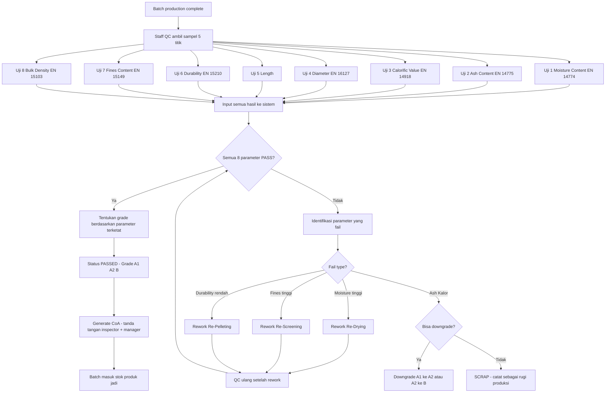

### Standar Kualitas ENplus

| Parameter | A1 | A2 | B | Metode |
|-----------|:---:|:---:|:---:|--------|
| Moisture | ≤ 10% | ≤ 10% | ≤ 10% | EN 14774-1 |
| Ash | ≤ 0.7% | ≤ 1.2% | ≤ 3.0% | EN 14775 |
| Calorific Value | ≥ 16.5 MJ/kg | ≥ 16.5 MJ/kg | ≥ 16.5 MJ/kg | EN 14918 |
| Diameter | 6±1 / 8±1 mm | Sama | Sama | EN 16127 |
| Length | 3.15-40 mm | Sama | Sama | — |
| Durability | ≥ 98.0% | ≥ 98.0% | ≥ 97.5% | EN 15210-1 |
| Fines | ≤ 0.5% | ≤ 0.5% | ≤ 1.0% | EN 15149-1 |
| Bulk Density | ≥ 600 kg/m³ | Sama | Sama | EN 15103 |

---

## 6. BP-05: Financial Close — Penutupan Keuangan

### Alur Proses

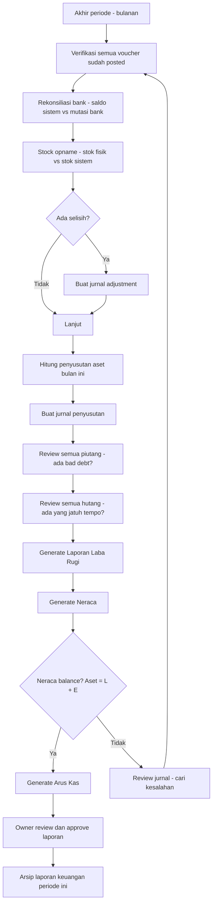

---

## 7. BP-06: Inventory Management — Siklus Stok

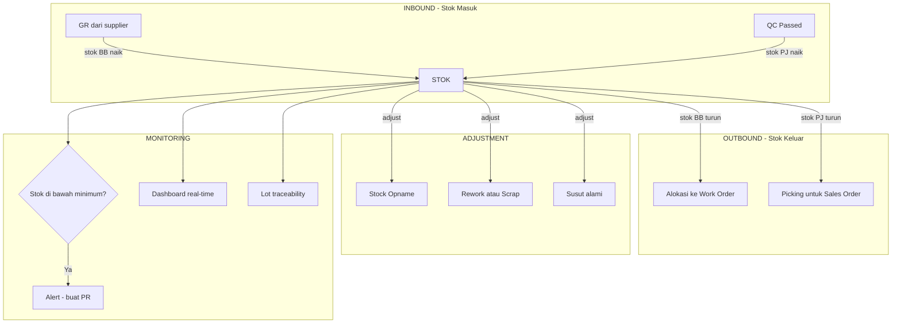

### Tipe Mutasi Stok

| Tipe | Simbol | Trigger | Contoh |
|------|:------:|---------|--------|
| **IN** | 🟢 | GR, QC Pass | Penerimaan BB, batch QC passed |
| **OUT** | 🔴 | WO consume, SO ship | Produksi pakai lot, pengiriman pelanggan |
| **ADJ+** | 🟡 | Opname surplus | Stock opname: fisik > sistem |
| **ADJ-** | 🟡 | Opname kurang, scrap | Stock opname: fisik < sistem, batch scrap |

---

## 8. BP-07: Portal Supplier Workflow

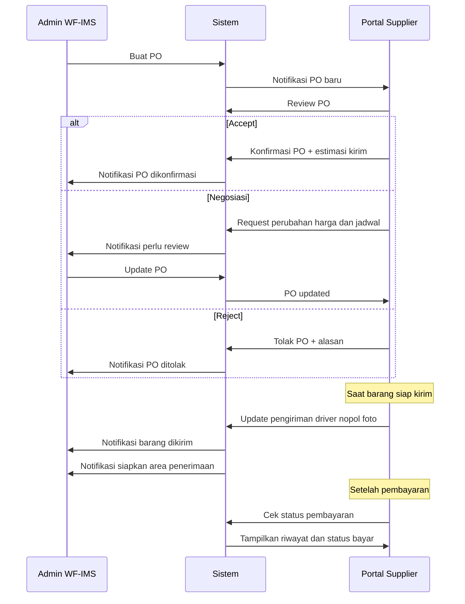

---

## 9. BP-08: Portal Pelanggan Workflow

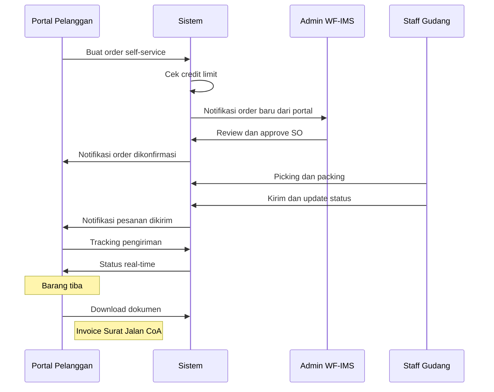

---

## 10. Cross-Module Integration Map

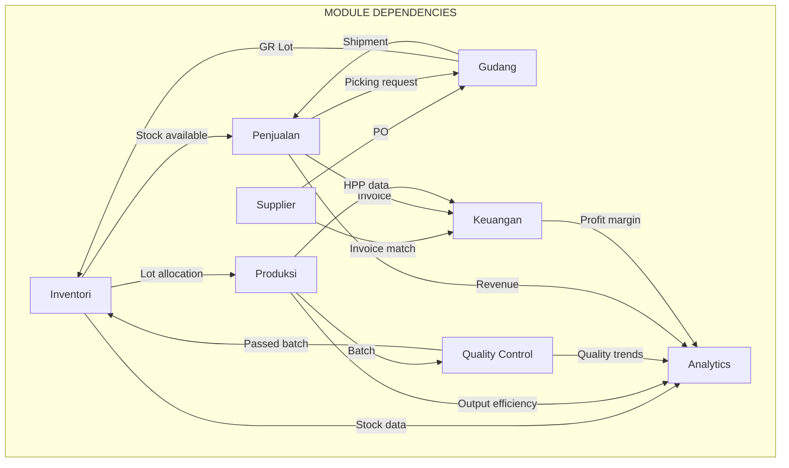

---

## 11. Status & State Machines

### Sales Order States

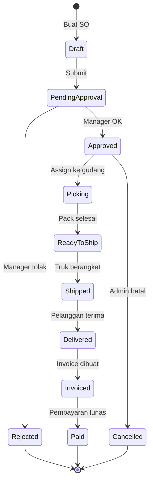

### Work Order States

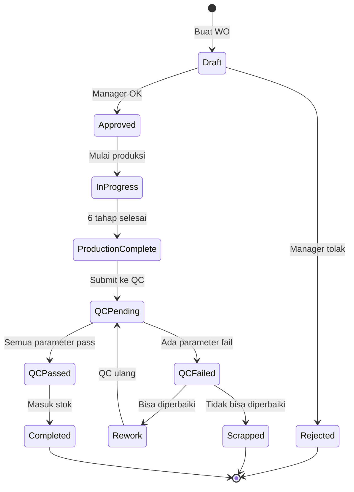

### Purchase Order States

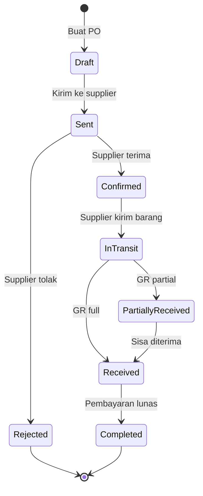